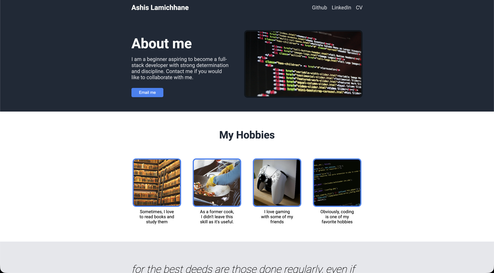

# My landing page

## About this Project

This Landing Page is a description of myself for my portfolio. It's a practice for the use of Flexbox in CSS, as it's my first project with this language.

This project is a task from The Odin Project, a structured full stack development course. You can learn at your own pace and it starts from 0 to getting employed. I highly recommend taking this course.
More on [The Odin Project](https://theodinproject.com/).

## Live Demo

Visit the page online: [landing page](https://axhis8.github.io/landing-page/)

## Features

- Use of CSS Flexboxes
- Buttons to send an email to the Author

## Built With

- HTML5
- CSS3

## What I Learned

- Flexbox
- CSS Alignment & Design

## Screenshot

## Credits

- Coding head-picture from [Pixabay](https://www.pexels.com/de-de/foto/html-quelltext-270366/)

- Cooking picture from [Cleam Onojeghuo](https://www.pexels.com/de-de/foto/person-die-auf-edelstahl-kochtopf-kocht-175753/)

- Library picture from [Gabriel Grip](https://www.pexels.com/de-de/foto/bucher-leiter-ecke-bibliothek-19369819/)

- Dualsense picture from [Pascal](https://www.pexels.com/de-de/foto/playstation-5-konsole-mit-dualsense-controller-33513532/)

- Coding hobbies-picture from [Pixabay](https://www.pexels.com/de-de/foto/computer-c-code-276452/)

- The Quote from the Prophet ﷺ from [Musnad Ahmad 8600](https://www.abuaminaelias.com/dailyhadithonline/2015/09/14/best-deeds-regular-small/)
